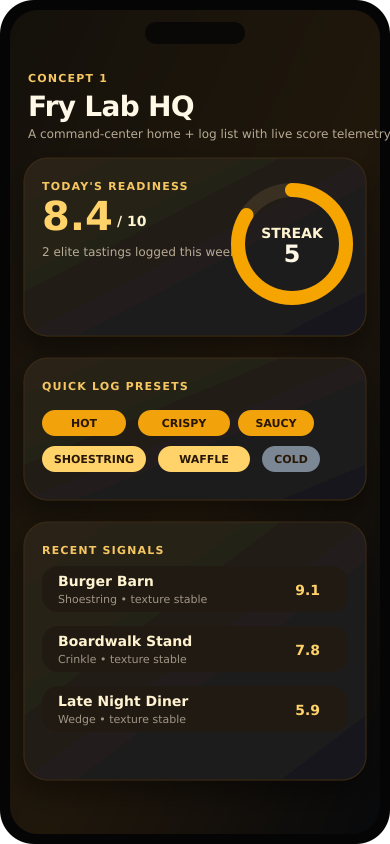
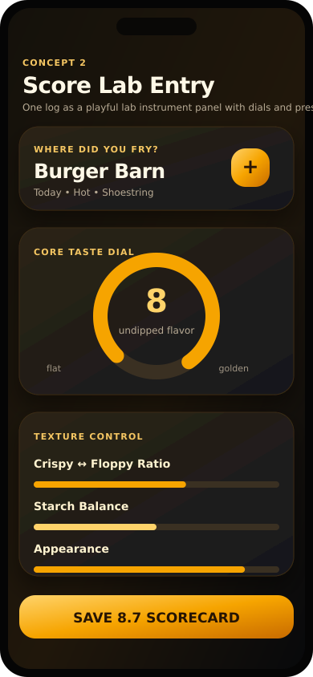
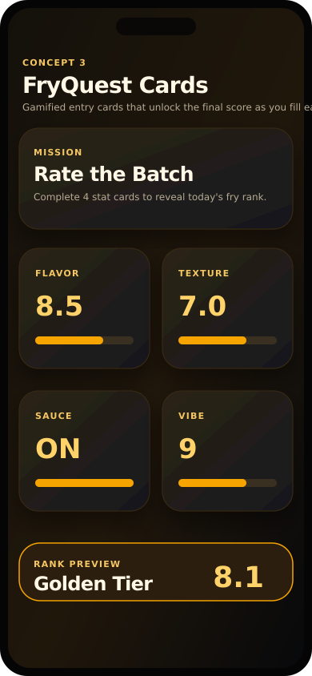
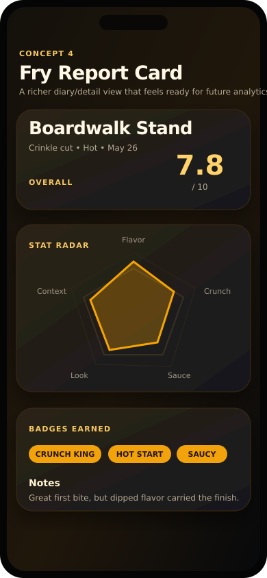

# Fry-By UI Mockup Concepts

These are visual-only mockups for choosing a direction before app code changes. They keep the existing log data model in mind: each diary entry has restaurant/context details, fry type, temperature, taste ratings, optional sauce/seasoning fields, texture spectrum values, notes, and a cumulative score out of 10.

## Concept 1: Fry Lab HQ

A pro dashboard-style landing/list concept with a dark interface, fry-orange telemetry accents, a readiness score, streak ring, one-tap preset chips, and recent log cards. This is the best fit if the app should immediately feel more analytical without adding a new analytics page yet.

## Concept 2: Score Lab Entry

A redesigned entry flow concept that turns a single diary log into an instrument panel. The emphasis is on dials/sliders, compact context fields, one-tap presets, and a score-aware save button.

## Concept 3: FryQuest Cards

A more playful/gamified entry concept where the user completes stat cards and earns a visible tier preview. This leans into delight while preserving the same rating fields and one-log-at-a-time workflow.

## Concept 4: Fry Report Card

A detail/diary concept that presents each log as a report card with an overall score, stat radar, badges, and notes. This can make the existing diary list feel more like an analytics product before a dedicated analytics screen exists.

## Direction Notes

- Shared palette: charcoal/black base, warm brown surfaces, and French-fry orange/yellow highlight colors.
- Shared tone: pro and analytic-heavy, with light gamification through streaks, badges, tiers, and score previews.
- No new data model fields are required for these directions; all visible stats can map to the current log data already collected.
- Recommended next decision: choose one dominant direction for the home/list screen and one dominant direction for the entry form, then translate those into SwiftUI components.
